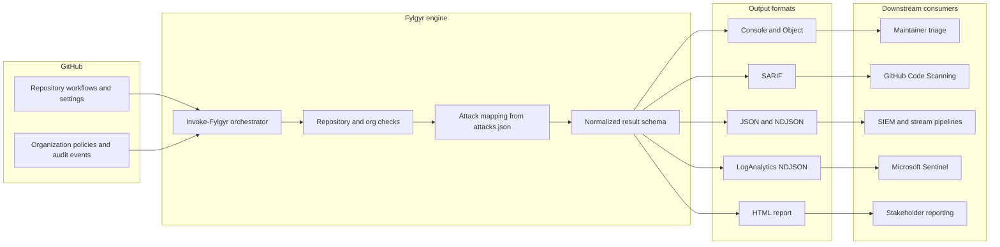
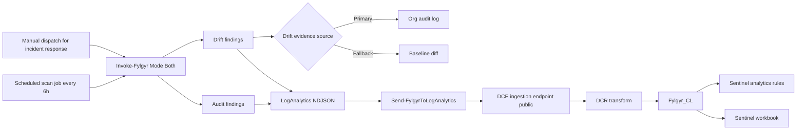

# Fylgyr Solution Architecture

This page documents the end-to-end architecture for Fylgyr and the Sentinel integration.

## End-to-end solution flow

## Sentinel integration flow (current scope)

This diagram reflects the currently supported rollout:

- Scheduled ingestion job as default
- Public Azure Monitor ingestion endpoint over TLS
- No VNet integration required

## Runtime choices for ingestion

You can run the ingestion job with either runtime:

1. GitHub Actions schedule with OIDC federation.
2. Azure Function timer with managed identity.

Both patterns use the same DCR stream and Sentinel artifacts under docs/sentinel.
