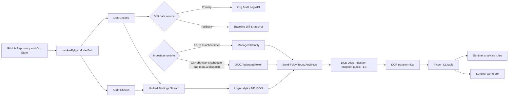

# Sentinel Architecture

```mermaid
flowchart LR
    A[GitHub Repository and Org State] --> B[Invoke-Fylgyr Mode Both]
    B --> C[Audit Checks]
    B --> D[Drift Checks]

    D --> E{Drift data source}
    E -->|Primary| F[Org Audit Log API]
    E -->|Fallback| G[Baseline Diff Snapshot]

    C --> H[Unified Findings Stream]
    D --> H
    H --> I[LogAnalytics NDJSON]

    J{Ingestion runtime}
    J -->|GitHub Actions schedule and manual dispatch| K[OIDC federated token]
    J -->|Azure Function timer| L[Managed Identity]

    I --> M[Send-FylgyrToLogAnalytics]
    K --> M
    L --> M

    M --> N[DCE Logs Ingestion endpoint public TLS]
    N --> O[DCR transformKql]
    O --> P[Fylgyr_CL table]

    P --> Q[Sentinel analytics rules]
    P --> R[Sentinel workbook]
```
